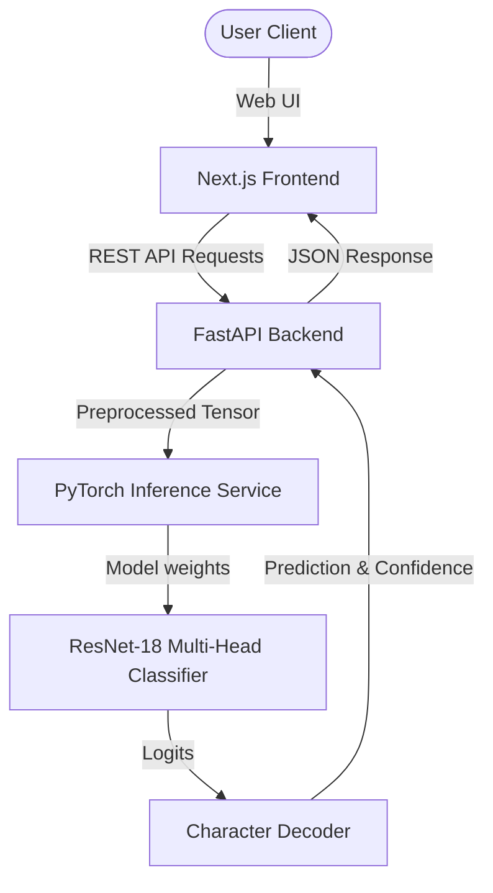

<div align="center">

# VisionSeq

### Distorted Visual Sequence Recognition with Deep Learning

**A full-stack OCR system that decodes 6-character distorted CAPTCHA sequences at 99.94% character accuracy — trained, served, and deployed end-to-end.**

[](https://huggingface.co/spaces/Hardik-25/VisionSeq)
[](https://www.python.org/)
[](https://pytorch.org/)
[](https://fastapi.tiangolo.com/)
[](https://nextjs.org/)
[](https://www.docker.com/)
[](LICENSE)

**[🚀 Live Demo](https://huggingface.co/spaces/Hardik-25/VisionSeq)** · **[🎥 Demo Video](#-demo-video)** · **[📖 Docs](#-documentation)**

</div>

---

## Overview

CAPTCHAs are designed to defeat automated readers — overlapping glyphs, background noise, and font distortion routinely break traditional OCR engines like Tesseract and EasyOCR. VisionSeq treats this as a **structured multi-task classification problem** rather than a general sequence-transcription problem: since every CAPTCHA in this dataset is exactly six characters long, a modified ResNet-18 backbone predicts all six character positions in a single forward pass, avoiding the alignment complexity of CTC-based approaches.

The result is a model that resolves **99.94% of individual characters** and **99.70% of full 6-character sequences** correctly — then wraps it in a production-style REST API and web interface so it can be evaluated as a real system, not just a notebook metric.

> 🔗 **Try it live:** [huggingface.co/spaces/Hardik-25/VisionSeq](https://huggingface.co/spaces/Hardik-25/VisionSeq)

<div align="center">


</div>

---

## 🎥 Demo Video

https://github.com/gautamhardik/VisionSeq/raw/master/assets/Demo.mp4

---

## Highlights

| | |
|---|---|
| 🎯 **99.94%** character accuracy | 6 failures out of 2,000 validation images |
| ⚡ **~170ms** CPU inference · **<50ms** on GPU | Sub-real-time single-image prediction |
| 🧠 **11.2M parameters** | Compact ResNet-18 backbone, no external OCR dependency |
| 🔒 **Hardened API** | Rate limiting, streaming upload limits, MIME verification, threadpool isolation |
| 🐳 **One-command deploy** | `docker compose up --build` — frontend, backend, and model in sync |
| 📊 **Fully documented** | Architecture, API, hardening, and audit docs included |

---

## Documentation

| Document | Description |
|---|---|
| 🏗️ [Architecture](docs/ARCHITECTURE.md) | System design, component responsibilities, and data pipeline |
| ⚡ [API Specification](docs/API.md) | Endpoint contracts, request/response schemas, error codes |
| 🛡️ [Hardening Notes](docs/HARDENING.md) | Security, concurrency, and reliability measures |
| 📋 [Engineering Audit](docs/AUDIT.md) | Independent production-readiness review and findings |
| 🛠️ [Deployment Guide](docs/DEPLOYMENT.md) | Local, Docker, and cloud deployment instructions |

---

## Problem Statement

The dataset consists of **20,000 grayscale 100×200 CAPTCHA images**, each labeled with a 6-character string drawn from a 31-character vocabulary (digits 2–9, uppercase A–Z excluding `I`, `L`, `O` — characters that are visually ambiguous with `1` and `0` in the rendering font). Images exhibit background noise, overlapping glyphs, blur, shape deformation, occlusion, and irregular spacing — designed specifically to defeat conventional OCR.

The task: given a distorted image, predict the exact 6-character sequence, evaluated on Character Error Rate (Levenshtein distance).

<div align="center">

|  |  |  |
|:---:|:---:|:---:|
| `7DUP98` | `6CUKRD` | `DX3YJ3` |

*Representative CAPTCHA samples from the dataset, showing overlapping glyphs, background noise, and blob occlusion.*

</div>

## Dataset

- **20,000** labeled training images, cleaned to **19,998** after removing 2 corrupted labels (Excel auto-formatting artifacts: `5.40E+12`, `04-Mar-54`) and 1 duplicate.
- Stratified **90/10 split** → 17,998 train / 2,000 validation.
- **2,761** unlabeled test images for final prediction.

## Modeling Approach

Rather than a CTC-based sequence decoder, each CAPTCHA is treated as **six simultaneous single-character classification problems**:

- **Backbone:** ResNet-18, first convolution modified for single-channel (grayscale) input, initialized from ImageNet weights (`weights="DEFAULT"`) — note this means the backbone is *fine-tuned*, not trained from scratch, which explains the unusually fast convergence.
- **Head:** `AdaptiveAvgPool2d((1, 6))` produces six independent 512-dim feature vectors, each classified by a shared `Linear(512, 31)` layer.
- **Loss:** Summed cross-entropy across all 6 positions, with 0.1 label smoothing to counter overconfidence (validation accuracy without smoothing was 0.07pp lower).
- **Optimizer:** AdamW (`lr=3e-4`, `weight_decay=1e-4`), `ReduceLROnPlateau`, gradient clipping at norm 5.0.

| Decision | Alternatives Considered | Rationale |
|---|---|---|
| Per-position classifier vs. CTC | CTC with blank token | Sequence length is fixed at 6, so CTC's variable-length alignment machinery is unnecessary overhead |
| ResNet-18 backbone | ResNet-34/50, custom CNN | Sufficient capacity for 100×200 input; larger models risk overfitting on ~18K samples |
| AdamW optimizer | SGD+momentum, Adam | Decoupled weight decay produced smoother early validation curves |
| Label smoothing (0.1) | None | Prevented >99% single-class overconfidence by epoch 2 |
| 31-class vocabulary | Full 36-character alphanumeric | Matches competition spec; `I`/`L`/`O` are visually indistinguishable from `1`/`0` in this font |

## Results

| Metric | Score | Interpretation |
|---|---|---|
| Character Accuracy | **99.94%** | ~1 misread character per 1,667 predictions |
| Sequence Accuracy | **99.70%** | 6 of 2,000 validation images had any error |
| Character Error Rate | **0.06%** | ~1 edit per 1,667 characters |

Training converged to 99.83% character accuracy within a single epoch (≈72s on a T4 GPU); the best checkpoint appeared at epoch 4, with the remaining 36 epochs oscillating between 99.93–99.94%. The single systematic confusion pattern observed was `5 ↔ S`, which the CAPTCHA font renders almost identically.

### Sample predictions

Example distorted CAPTCHA inputs from the test set, alongside the model's decoded output:

| Input | Prediction | Confidence |
|---|---|---|
|  | `7DUP98` | 99.7% |
|  | `6CUKRD` | 99.4% |
|  | `DX3YJ3` | n/a |

## What Didn't Work

- **Blank-class vocabulary (32 classes):** Added in anticipation of a CTC approach; became a dead class once the fixed-length per-position design was adopted. Removed after epoch 1.
- **No label smoothing:** Dropped validation character accuracy from 99.90% → 99.83% in a single-epoch comparison; smoothing was reinstated.

## Known Limitations

- Systematic `5`/`S` confusion in this specific font.
- Fixed to exactly 6 characters — cannot handle variable-length sequences.
- No out-of-distribution rejection: the model always emits a confident 6-character prediction, even for non-CAPTCHA input.
- Trained on a single CAPTCHA rendering engine; generalization to other generators (different noise/warping) is untested.

---

## System Architecture



A decoupled, service-oriented stack: Next.js frontend → FastAPI backend → singleton PyTorch inference service. See [ARCHITECTURE.md](docs/ARCHITECTURE.md) for full component breakdown.

## Production Hardening

Following an internal engineering audit ([AUDIT.md](docs/AUDIT.md)), the backend was hardened against 8 identified issues spanning DoS protection, blocking I/O, insecure MIME validation, unpinned dependencies, missing warmup, hardcoded config, shallow health checks, and absent rate limiting. Full detail in [HARDENING.md](docs/HARDENING.md).

---

## Tech Stack

| Layer | Technologies |
|---|---|
| **Frontend** | Next.js, React, TypeScript, Tailwind CSS, Framer Motion |
| **Backend** | FastAPI, Uvicorn, Pydantic |
| **ML** | PyTorch, ResNet-18, torchvision |
| **Infra** | Docker, Docker Compose, GitHub Actions CI |
| **Deployment** | Hugging Face Spaces (live demo), Vercel / Render-compatible |

## Repository Structure

```
VisionSeq/
├── .github/workflows/ci.yml
├── assets/                  # ui-demo.png, sample-7DUP98.png, sample-6CUKRD.png, sample-DX3YJ3.png
├── backend/
│   ├── app/
│   │   ├── api/routes.py
│   │   ├── core/config.py
│   │   ├── models/resnet18.py
│   │   ├── services/{preprocessing,inference,decoding}.py
│   │   ├── schemas/
│   │   └── utils/rate_limiter.py
│   ├── weights/final_resnet18_captcha.pth
│   └── main.py
├── frontend/
│   └── app/{layout.tsx, page.tsx, globals.css}
├── docs/
│   ├── ARCHITECTURE.md
│   ├── API.md
│   ├── AUDIT.md
│   ├── DEPLOYMENT.md
│   └── HARDENING.md
├── notebooks/
├── docker-compose.yml
└── README.md
```

## Quick Start

```bash
git clone https://github.com/<your-username>/VisionSeq.git
cd VisionSeq
docker compose up --build
```

- Frontend → `http://localhost:3000`
- Backend API → `http://localhost:8000`
- Swagger docs → `http://localhost:8000/docs`

> 💡 **Testing the App:** You can find sample CAPTCHA images to upload and test the application in the `test_images/` directory of this repository.

Full setup instructions (Docker and local virtualenv) are in the [Deployment Guide](docs/DEPLOYMENT.md).

## Author

**Hardik**

📎 [Live Demo](https://huggingface.co/spaces/Hardik-25/VisionSeq) · 🎥 Demo video (link above) · 📄 [Architecture](docs/ARCHITECTURE.md)

## License

MIT — see [LICENSE](LICENSE).
