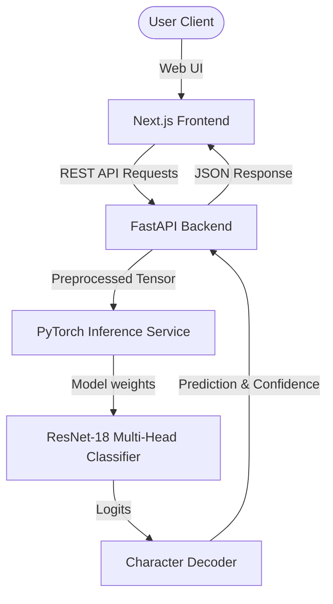

# System Architecture

This document describes the high-level system architecture of the CAPTCHA OCR platform.

## Architecture Overview

The system is designed as a decoupled, service-oriented architecture containing a Next.js frontend, a FastAPI backend, and an in-memory PyTorch deep learning service.

---

## Component Details

### 1. Frontend: Next.js + Tailwind CSS
- **Visual Presentation**: Responsive modern dashboard utilizing glassmorphism, hover animations (Framer Motion), and real-time canvas preview.
- **API Client**: Sends async requests to the FastAPI backend with batching support and shows character-by-character confidence breakdowns.

### 2. Backend: FastAPI
- **Web API**: Exposes JSON endpoints for single prediction, batch prediction, metadata info, and active health monitoring.
- **Middleware**: Intercepts large uploads at the boundary (Content-Length limiter) and defends resources using token-bucket rate limiting.
- **Threadpool Scheduling**: Wraps CPU/GPU-bound preprocessing and inference tasks in `run_in_threadpool()` to prevent blockages of the FastAPI event loop.

### 3. ML Inference Service: PyTorch & ResNet-18
- **Model Lifetime**: Loaded once upon backend startup as a singleton (`InferenceService`) to prevent loading overhead on request paths.
- **Execution Mode**: Runs in `eval()` mode. Pre-warmed during boot with a dummy input tensor of shape `[1, 1, 100, 200]` to compile kernels and initialize the CUDA context.
- **Device Management**: Auto-selects GPU execution (`cuda`) if hardware is available, otherwise safely falls back to CPU execution.
- **Multi-Position Head**: Treats CAPTCHA recognition as 6 concurrent character classification tasks. Features a modified ResNet-18 backbone (1-channel input) pooled to shape `[B, 512, 6]` and classified into a 31-class vocabulary.

---

## Data Pipeline

1. **Upload**: User uploads a distorted CAPTCHA image.
2. **Defensive Check**: Middleware validates request size and checks rate limit status.
3. **MIME Verification**: API verifies the upload's MIME type (must start with `image/`).
4. **Streaming Read Check**: Endpoint reads the image in 64KB chunks to ensure it stays below 5MB.
5. **Structural Integrity**: `PIL.Image.verify()` checks that the image file is not corrupted.
6. **Preprocessing (Threadpool)**: Grayscale conversion, resizing to `100x200`, normalization, and tensor conversion (`[1, 1, 100, 200]`).
7. **Model Evaluation (Threadpool)**: ResNet-18 runs forward pass to yield raw logits of shape `[1, 6, 31]`.
8. **Decoding**: Softmax is applied; max probability indices decode into character predictions from the 31-character vocabulary.
9. **Telemetry**: API updates metrics (uptime, requests served) and writes structured logs before returning the result.
